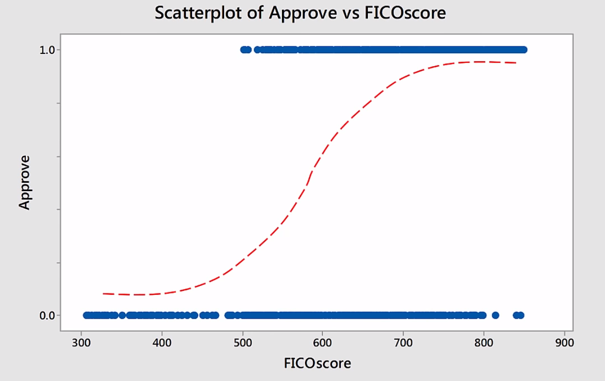

# 统计学课程Statistics 101笔记
## PL15 - Multiple Linear Regression
>相比于之前我们在课本中提到过的一元线性回归，这里拓展到了多元线性回归。如下图所示，我们讨论三种观点：
>+ 我们不能将一元线性回归分别用于多元线性回归，这样会造成过拟合。
>+ 多个自变量之间可能会有相关关系，叫做多重共线性，我们要适当进行取舍。
>+ 理想的情况下是每个自变量都和因变量有相关关系，但自变量之间相互独立。
 

 

 

>因此，我们除了要讨论自变量和因变量之间的关系，还要讨论各个自变量之间的关系。如下图若有四个自变量我们要讨论10种相关关系。 

 

 

>下面一张图给我们介绍了多元线性回归的步骤： 

 

 

>我们从第三步、第四步开始说起，一般先是用散点图进行目测，下面的例子中有三个自变量。因此我们做出三个自变量和因变量之间的散点图、三个自变量之间的散点图： 

 

 

>下图1，我们观察到前两个自变量和因变量之间有强线性关系，最后一个自变量和因变量之间没有强线性关系。因此我们在构建模型时往往不会使用第三个自变量。下图2，我们观察到自变量 x1,x2 之间有强线性关系; x1,x3 之间 x2,x3 之间没有强线性关系。因此我们在构建模型时往往会在 x1 和 x2 之间选择一个，因为他们之间存在多重共线性问题。 

 

 

 

 

>我们还可以用 matlab 求出各个变量之间准确的相关系数(Pearson correlation)和 p-value (统计学根据显著性检验方法所得到的P 值，一般以P < 0.05 为显著， P <0.01 为非常显著，其含义是样本间的差异由抽样误差所致的概率小于 0.05 或 0.01)。可以得出和上面目测散点图相似的结论： 

 

 

>现在我们进行第五步，我们用三个自变量分别进行一元回归分析。得出下面的统计表.这里的 F 值来自于 ANOVA (方差分析中 $F=Q_A-hat/Q_E-hat$，需要补充理解的是：[线性回归和方差分析的关联](https://blog.csdn.net/xiangmin_meng/article/details/22402545))。F 值越高，说明二者线性关系越显著，p-value 越小。$R^2=SSR/SST$，越接近 1 表明方程的变量对 y 的解释能力越强，这个模型对数据拟合的也较好。你可以看到 $R^2$ 分为 $R^2(adjusted) 和 R^2(prediction)$，adjusted 表明拟合程度，而prediction 表明对新的数据点的预测准确度： 

 

 

>下面我们引入两个变量的回归指标和 VIF (varience inflation factor)。前三行是之前单自变量拟合情况，后三个分别以 $(x1,x2)、(x1,x3)、(x2,x3)$ 为自变量进行拟合，我们发现因为每一种组合要么包含 x1,要么包含 x2 因此$R^2(adjusted)$ 都不低，但是第四行的 VIF 值很高，并且$R^2(prediction)$相比于$R^2(adjusted)$低了很多，这就说明出现了过拟合情况。VIF 的作用在下面的黑字中有介绍，用来评价自变量的相关性。单从这个表中我们发现第五行第六行在各方面都有不错的表现。但是我们在拟合后的系数中其实会发现有的系数是不符合实际情况的，即 x3 的系数是负值，之前我们介绍了 x3 和 y 之间的线性性不强，因此这里引入 x3 有些多余： 

 

 

>最后我们将三个变量统一起来构成自变量$(x1,x2,x3)$，回归后的指标如下。我们看到 $R^2(prediction)=57.49%$ 很低，VIF $x1=14.94$ 很高，$x2=17.35$ 很高，因此存在很严重的多重共线性问题： 

 

 

>那么最后，我们需要选择一个最好的模型。排除高的 VIF 选项第 4 个$(x1,x2)$ 和第 7 个后$(x1,x2,x3)$ ，我们将关注以下几个因素进行进一步筛选：
>+ $R^2(adjusted)$ $R^2(prediction)$ 较高，并且二者很接近
>+ 标准差 s 较低
>+ 模型尽可能简单

>于是，很明显的，第一个模型就是最佳模型，只由 x1 构成自变量的模型。以上的相关拟合数据可以由 Minitab 生成，在 Minitab 中还会生成一个叫做 $Mallows C_p$的指标，介绍见下图第四点。1.9 接近于 1+1=2 因此第一个模型的这个指标也是很好的： 

 

 

>下面还有关于 Dummy Varible 的补充。我们上面见到的自变量都有连续的取值，但是有些时候影响因变量结果的因素不一定是连续的，我们称之为分类变量。比如下面这个例子关于房屋价格影响因素，x1 是房屋的面积，x2 是所属高中是否是典范高中。因此 x2 只有两种情况，是或不是。因此我们需要对 x2 进行编码，很容易想到是的话编码为 x2=1 ，否的话编码为 x2=0。线性模型为 $y=β0+β1·x1+β2·x2$。其他的操作和之前多变量线性回归相同。但是如果大于 1 个变量是分类变量，编码方法如下，下图为方向为 4 种选项的情况。而此时 $Dummy Varible = n - 1 = 4-1=3(x1,x2,x3三个虚变量)$，第一种情况$Dummy Varible = n - 1 = 2-1=1$： 

 

 

>对于房屋的例子，我们最终得到的结果往往如下，图一是综合考虑二者的平均，图二是将二者区分开进行考虑： 

 

 
 

 

>下面依旧是房屋价格的例子，只不过这次除了房屋面积，还增加了 location 和典范高中的信息，location 分为东南西北四个，因此$Dummy Varible = n - 1 = 4-1=3$，下图是关于部分数据的编码情况，我们看到只有三个 Dummy Varible，其中 east 被编码为 $(0,0,0)$： 

 

 

>下面是模型的 Equation，还有一个例子，以及模型包含的等式个数： 

 

 

>之后通过 Minitab 或其他工具包，我们可以得到各个变量的系数信息。我们重点关注 P-Value 的值，我们可以看到 sqrt，exemplary，west 三者的 P-Value 较低，也就是对应的显著性水平较高。因此他们三者对房屋价格影响应当是最大的： 

 

 

>我们按 exemplary 的 yes or no 对结果进行分类作图，两个图的绿色线都是 west 对应的拟合结果，可以看到 west location 房屋相对便宜很多。两幅图对比看整体，图一的截距整体相对于图二的截距要低一些，说明 exemplary 为 yes 的房屋价格要高于 no 的： 

 

 

## PL16-Logistic Regression
>本节只对逻辑回归进行一个简单了解性的介绍。首先我介绍一下关于几率(odds)的概念，几率和概率是紧密联系的，下面这张图介绍了几率和概率(probability)、以及几率比率(odds raito)的概念。我们看到均匀的硬币掷出 head 的概率为 0.5，不均匀的(loaded)硬币掷出 head 的概率为 0.7。几率就是事件发生的概率/时间不发生的概率。几率比率就是两个事件的几率比值： 

 

 

>而逻辑回归问题往往处理的是自变量有很多种，因变量是一个二分类的变量的问题。比如根据信用评分来决定是否进行贷款的问题。因此，逻辑回归的问题主要集中在概率的讨论上，比如给出一个信用评分，有多大的概率可以进行贷款。而根据已知数据点进行拟合时，我们常常用下面的 Sigmoid 函数进行，Sigmoid 函数就是 $ln(p/1-p)$ 的逆函数。其中的参数计算用到了最大似然估计的内容： 

 

 

 

 

>需要注意的是逻辑回归中，同间隔的两个自变量点的几率比值始终为一个定值，我们看下面这个例子，讲的是根据信用评分来决定是否进行贷款的问题。相应的系数计算过程课程中没有讲，在此就略去。我们分别代入 $x=720 和 x=721$ 两个点的几率，进一步我们可以得到二者的几率比值为 1.0146，如下图所示： 

 

 

>也就是说，无论起始点在哪，只要 x 增加一个单位，原来的几率与增加后的几率比值都是 1.0146，并且 Minitab 等软件会给我们一个置信区间(confidence interval ( CI ))，如果这个置信区间中包含 1 就说明 x 的增加可能会对判定结果的几率/概率没有影响(这里 1.0147 和 1.0146 只是舍入的区别)： 

 

 

>最后一点是关于 x (FICO) 增加的幅度，得到的几率比率图。这幅图有意思的点在于，它完全符合一个指数函数的形式，并且指数的系数 0.0146 恰好等于我们得到的 p-hat 的系数 β1 ： 

 

 
