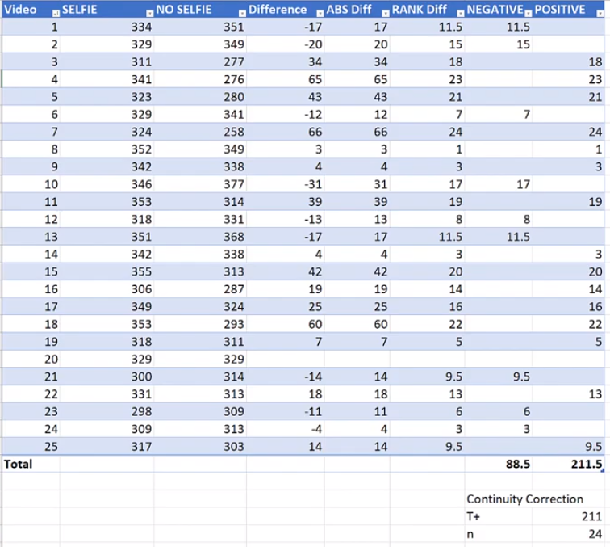

<!-- TOC -->

- [统计学课程Statistics 101笔记](#统计学课程statistics-101笔记)
    - [PL15 - Multiple Linear Regression](#pl15---multiple-linear-regression)
    - [PL16 - Logistic Regression](#pl16---logistic-regression)
    - [PL17 - ANCOVA (ANalysis of COVAriance)](#pl17---ancova-analysis-of-covariance)
    - [PL19 - Nonparametric Methods](#pl19---nonparametric-methods)
        - [Sign Test For Median Examples](#sign-test-for-median-examples)
        - [Mann-Whitney-Wilcoxon Rank Sum Test](#mann-whitney-wilcoxon-rank-sum-test)
        - [Wilcoxon Signed Rank Test](#wilcoxon-signed-rank-test)
        - [Kruskal-Wallis Test](#kruskal-wallis-test)
        - [Friedman Test](#friedman-test)
        - [Spearman Rank Correlation](#spearman-rank-correlation)
        - [Mood's Median Test](#moods-median-test)

<!-- /TOC -->
# 统计学课程Statistics 101笔记
## PL15 - Multiple Linear Regression
>相比于之前我们在课本中提到过的一元线性回归，这里拓展到了多元线性回归。如下图所示，我们讨论三种观点：
>+ 我们不能将一元线性回归分别用于多元线性回归，这样会造成过拟合。
>+ 多个自变量之间可能会有相关关系，叫做多重共线性，我们要适当进行取舍。
>+ 理想的情况下是每个自变量都和因变量有相关关系，但自变量之间相互独立。
 

 

 

>因此，我们除了要讨论自变量和因变量之间的关系，还要讨论各个自变量之间的关系。如下图若有四个自变量我们要讨论10种相关关系。 

 

 

>下面一张图给我们介绍了多元线性回归的步骤： 

 

 

>我们从第三步、第四步开始说起，一般先是用散点图进行目测，下面的例子中有三个自变量。因此我们做出三个自变量和因变量之间的散点图、三个自变量之间的散点图： 

 

 

>下图1，我们观察到前两个自变量和因变量之间有强线性关系，最后一个自变量和因变量之间没有强线性关系。因此我们在构建模型时往往不会使用第三个自变量。下图2，我们观察到自变量 x1,x2 之间有强线性关系; x1,x3 之间 x2,x3 之间没有强线性关系。因此我们在构建模型时往往会在 x1 和 x2 之间选择一个，因为他们之间存在多重共线性问题。 

 

 

 

 

>我们还可以用 matlab 求出各个变量之间准确的相关系数(Pearson correlation)和 p-value (统计学根据显著性检验方法所得到的P 值，一般以P < 0.05 为显著， P <0.01 为非常显著，其含义是样本间的差异由抽样误差所致的概率小于 0.05 或 0.01)。可以得出和上面目测散点图相似的结论： 

 

 

>现在我们进行第五步，我们用三个自变量分别进行一元回归分析。得出下面的统计表.这里的 F 值来自于 ANOVA (方差分析中 $F=Q_A-hat/Q_E-hat$，需要补充理解的是：[线性回归和方差分析的关联](https://blog.csdn.net/xiangmin_meng/article/details/22402545))。F 值越高，说明二者线性关系越显著，p-value 越小。$R^2=SSR/SST$，越接近 1 表明方程的变量对 y 的解释能力越强，这个模型对数据拟合的也较好。你可以看到 $R^2$ 分为 $R^2(adjusted) 和 R^2(prediction)$，adjusted 表明拟合程度，而prediction 表明对新的数据点的预测准确度： 

 

 

>下面我们引入两个变量的回归指标和 VIF (varience inflation factor)。前三行是之前单自变量拟合情况，后三个分别以 $(x1,x2)、(x1,x3)、(x2,x3)$ 为自变量进行拟合，我们发现因为每一种组合要么包含 x1,要么包含 x2 因此$R^2(adjusted)$ 都不低，但是第四行的 VIF 值很高，并且$R^2(prediction)$相比于$R^2(adjusted)$低了很多，这就说明出现了过拟合情况。VIF 的作用在下面的黑字中有介绍，用来评价自变量的相关性。单从这个表中我们发现第五行第六行在各方面都有不错的表现。但是我们在拟合后的系数中其实会发现有的系数是不符合实际情况的，即 x3 的系数是负值，之前我们介绍了 x3 和 y 之间的线性性不强，因此这里引入 x3 有些多余： 

 

 

>最后我们将三个变量统一起来构成自变量$(x1,x2,x3)$，回归后的指标如下。我们看到 $R^2(prediction)=57.49%$ 很低，VIF $x1=14.94$ 很高，$x2=17.35$ 很高，因此存在很严重的多重共线性问题： 

 

 

>那么最后，我们需要选择一个最好的模型。排除高的 VIF 选项第 4 个$(x1,x2)$ 和第 7 个后$(x1,x2,x3)$ ，我们将关注以下几个因素进行进一步筛选：
>+ $R^2(adjusted)$ $R^2(prediction)$ 较高，并且二者很接近
>+ 标准差 s 较低
>+ 模型尽可能简单

>于是，很明显的，第一个模型就是最佳模型，只由 x1 构成自变量的模型。以上的相关拟合数据可以由 Minitab 生成，在 Minitab 中还会生成一个叫做 $Mallows C_p$的指标，介绍见下图第四点。1.9 接近于 1+1=2 因此第一个模型的这个指标也是很好的： 

 

 

>下面还有关于 Dummy Varible 的补充。我们上面见到的自变量都有连续的取值，但是有些时候影响因变量结果的因素不一定是连续的，我们称之为分类变量。比如下面这个例子关于房屋价格影响因素，x1 是房屋的面积，x2 是所属高中是否是典范高中。因此 x2 只有两种情况，是或不是。因此我们需要对 x2 进行编码，很容易想到是的话编码为 x2=1 ，否的话编码为 x2=0。线性模型为 $y=β0+β1·x1+β2·x2$。其他的操作和之前多变量线性回归相同。但是如果大于 1 个变量是分类变量，编码方法如下，下图为方向为 4 种选项的情况。而此时 $Dummy Varible = n - 1 = 4-1=3(x1,x2,x3三个虚变量)$，第一种情况$Dummy Varible = n - 1 = 2-1=1$： 

 

 

>对于房屋的例子，我们最终得到的结果往往如下，图一是综合考虑二者的平均，图二是将二者区分开进行考虑： 

 

 
 

 

>下面依旧是房屋价格的例子，只不过这次除了房屋面积，还增加了 location 和典范高中的信息，location 分为东南西北四个，因此$Dummy Varible = n - 1 = 4-1=3$，下图是关于部分数据的编码情况，我们看到只有三个 Dummy Varible，其中 east 被编码为 $(0,0,0)$： 

 

 

>下面是模型的 Equation，还有一个例子，以及模型包含的等式个数： 

 

 

>之后通过 Minitab 或其他工具包，我们可以得到各个变量的系数信息。我们重点关注 P-Value 的值，我们可以看到 sqrt，exemplary，west 三者的 P-Value 较低，也就是对应的显著性水平较高。因此他们三者对房屋价格影响应当是最大的： 

 

 

>我们按 exemplary 的 yes or no 对结果进行分类作图，两个图的绿色线都是 west 对应的拟合结果，可以看到 west location 房屋相对便宜很多。两幅图对比看整体，图一的截距整体相对于图二的截距要低一些，说明 exemplary 为 yes 的房屋价格要高于 no 的： 

 

 

## PL16 - Logistic Regression
>本节只对逻辑回归进行一个简单了解性的介绍。首先我介绍一下关于几率(odds)的概念，几率和概率是紧密联系的，下面这张图介绍了几率和概率(probability)、以及几率比率(odds raito)的概念。我们看到均匀的硬币掷出 head 的概率为 0.5，不均匀的(loaded)硬币掷出 head 的概率为 0.7。几率就是事件发生的概率/时间不发生的概率。几率比率就是两个事件的几率比值： 

 

 

>而逻辑回归问题往往处理的是自变量有很多种，因变量是一个二分类的变量的问题。比如根据信用评分来决定是否进行贷款的问题。因此，逻辑回归的问题主要集中在概率的讨论上，比如给出一个信用评分，有多大的概率可以进行贷款。而根据已知数据点进行拟合时，我们常常用下面的 Sigmoid 函数进行，Sigmoid 函数就是 $ln(p/1-p)$ 的逆函数。其中的参数计算用到了最大似然估计的内容： 

 

 

 

 

>需要注意的是逻辑回归中，同间隔的两个自变量点的几率比值始终为一个定值，我们看下面这个例子，讲的是根据信用评分来决定是否进行贷款的问题。相应的系数计算过程课程中没有讲，在此就略去。我们分别代入 $x=720 和 x=721$ 两个点的几率，进一步我们可以得到二者的几率比值为 1.0146，如下图所示： 

 

 

>也就是说，无论起始点在哪，只要 x 增加一个单位，原来的几率与增加后的几率比值都是 1.0146，并且 Minitab 等软件会给我们一个置信区间(confidence interval ( CI ))，如果这个置信区间中包含 1 就说明 x 的增加可能会对判定结果的几率/概率没有影响(这里 1.0147 和 1.0146 只是舍入的区别)： 

 

 

>最后一点是关于 x (FICO) 增加的幅度，得到的几率比率图。这幅图有意思的点在于，它完全符合一个指数函数的形式，并且指数的系数 0.0146 恰好等于我们得到的 p-hat 的系数 β1 ： 

 

 

## PL17 - ANCOVA (ANalysis of COVAriance)
>这里只简要说明一下 ANCOVA 的作用。作者举了一个例子是关于学生年级为分类型自变量和学习能力评分为连续型因变量之间的关系。如果只有这一个自变量和因变量就可以使用 One-way ANOVA。但是，我们知道影响学习能力评分的因素可能还有学生自身的 GPA，也就是说 GPA 也可以被讨论进来。于是就有两个自变量，分类型的学生年级和连续型的 GPA： 

 

 

>ANCOVA 其实就是根据协变量 GPA 与学习能力评分之间存在的线性关系，来调整学生年级变量对学习能力评分的影响。体现在误差上就是，一部分 SSE 分给了 Cov 协变量，毕竟协变量也会对最终结果产生影响。如果协变量与因变量之间存在强线性关系，那么会有很大一部分误差分给 Cov，于是原变量的显著性水平就会大幅提高。 

 

 

>ANCOVA 最终对原变量的测试其实是在保证其他所有协变量一致的情况下进行的。更准确的来说就是通过对原变量各个学生年级的学习能力评分的平均值来测试的。下面这张图就是 ANOVA 和 ANCOVA 二者对均值的改变情况。并且最终将 GPA 控制在一个相同的水平 2.9843 下： 

 

 

## PL19 - Nonparametric Methods
>在一个统计推断问题中，如果总体分布的具体形式已知(最常见的是假定为正态分布)，则我们只需对其中含有的若干个未知参数作出估计或进行某种形式的假设检验，这类推断方法称为参数方法。但在许多实际问题中，我们对总体分布的形式往往所知甚少(如只能作出诸如连续型分布、关于均值对称等微弱的假定)，甚至一无所知。这时就需要使用不必(或很少)依赖于总体分布形式的统计推断方法，此类推断方法通常称为非参数方法(non-parametric method)。 

### Sign Test For Median Examples

>我们从最简单的符号检验中位数开始讲起。比如我们对于一个容量为 12 的样本，来估计总体的中位数，样本如下图所示。我们假设总体的中位数为 60200 ，即大约在第三个样本和第四个样本之间的一个值。并检验假设 $H_0:Median=60200$ $H_α：Median≠60200$。我们统计样本中小于 60200 和大于 60200 的样本个数以及占总体的概率 p。是否符合假设 $H_0:P\{x<60200\}=0.5$ $H_α:P\{x<60200\}≠0.5$。若不符合，有多大的概率可以否定原假设。注意假设 $H_0:p=0.5$ $H_α:p≠0.5$使得样本中大于/小于 60200 的个数 N 符合二项分布 $B(n,p)=B(12,0.5)$。 

 

 

>按照上图所示的样本，我们看到样本中小于 60200 的有 3 个，根据原假设 $H_0:p=0.5$，我们得到下面的二项分布表，即 12 个样本中若出现 0-12 个小于 60200 的值的概率。根据之前的假设检验知识我们知道， 0/1/2/3 个小于 60200 的值出现的概率之和，即 0.073，我们可以作为单边的小概率事件的概率。因为原假设涉及的检验是双边检验。因此 $p-value = 0.073 * 2 = 0.146$，若取显著性水平为 0.10 ，则 $p-value > α$，也就是说对于显著性水平 0.10 对应的 N 应当是小于 3 或者大于 9 的，于是我们样本中出现的 3 个就满足相应的要求。于是我们不能拒绝原假设$H_0:P\{x<60200\}=0.5$，也就是$H_0:Median=60200$。  

 

 

>但这貌似是不合理的，因为按照常理来说我们应当选取第六个到第七个样本之间的一个值作为中位数。其他的都应该尽量否定假设。问题就出在样本量上，样本太小导致估计不准确。我们接下来再假设$H_0:Median=97600$ $H_α：Median≠97600$。我们样本中有 2 个是大于 97600 ，10 个小于97600。于是我们统计二项分布 $B(n,p)=B(12,0.5)$ 中小于 2 和 大于 10 二者的概率和 p-value = 0.036，对于显著性水平 $0.10 > p-value$，于是我们否定了原假设。于是对于二项分布 $B(n,p)=B(12,0.5)$ 显著性水平 0.10，恰好满足的 N 的数量应当是介于 2 个到 3 个之间的一个值，或者说 9 个到 10 个之间的一个值： 

 

 

>如果我们选择更大一点的样本量，根据以往的知识，二项分布 $B(n,p)$ 可近似看为连续的正态分布 $N(np,np(1-p))$。下面这个例子就讲的是更大的样本我们用正态分布近似二项分布进行非参数检验。右下角是我们的假设，我们看到这是一个单边假设。样本中有 51 个工资小于 75K 的员工，34 个工资大于 75K 的员工。 

 

 

>于是我们将 $B(n,p)=B(85,0.5)$ 近似于 $N(np,np(1-p))=N(42.5,21.25)$，我们按照下面的步骤进行检验。需要强调的是，离散的情况下我们本来要检验 $P(x<=34)$ 与对应显著性水平大小关系，但是转换为连续的就需要加 0.5 变成 $P(x<=34.5)$ (continuity correction factor)。因为连续的二项分布我们就构造统计量：$\frac{X-μ}{σ}$，查表 $N(0,1)$ 即可得到对应的大小关系。
 

 

 

>查表后结果如下，若显著性水平取 $α=0.05$，$P=0.0413 < α$，于是否定原假设 $Median >= 75000$。: 

 

 

>最后总结一下关键点如下图。其实关键就是把中位数的检验转化为样本中大于/小于中位数个数的检验。这个检验就叫做符号检验(sign-test)。我们不用知道原来数据的分布情况，仅凭大于/小于中位数的样本数即可决定检验结果：
 

 

 

### Mann-Whitney-Wilcoxon Rank Sum Test
>我们先介绍一下Mann-Whitney-Wilcoxon Rank Sum Test的背景(作用)。在参数检验中，我们如果需要检验两个正态总体的均值是否相等，我们会用到 t-test，但在非参数检验中，Mann-Whitney-Wilcoxon Rank Sum Test 给我们提供了一个当两个总体分布未知的情况下，二者的中位数是否相等的方法。我们采用的是从两个总体中分别抽取一定样本，来对这些样本进行一定的“排名(rank)”，我们在检验时，并不关注样本的准确数值而是只关注样本的排名情况，来判定二者的中位数是否相同/判定两组样本是否来自同一总体： 

 

 

>这里先举一个简单的例子，十位同学分别给两家星巴克(C店和N店)打分，五位给 C 店打分，另外五位给 N 店打分。我们要判定的是，这两家星巴克的环境是否是几乎一致的，体现在分数上就是十份评分基本一致，抽象一些就是十份评分是来自同一总体。我们先介绍一个极端情况，即下图所示，RANK 是十份评分的排名情况，很明显 N 店都排在前面，C 店都排在后面。那么什么时候二者可以判定为来自同一个总体呢? 因为是非参数方法，通过评分排名来看，我们希望两家店面各自的评分排名之和都处于 27.5 附近 

 

 

>下面这张图就是最理想的情况，两家店面的打分之和都在 27.5 附近，一个 25 一个 30。这样的话我们就不能拒绝原假设 $H_0:两家店面的环境一致$： 

 

 

>上面只是一个定型的了解，下面我们通过数据来讲解Mann-Whitney-Wilcoxon Rank Sum Test的检验过程。下面是检验的步骤。需要说明的是第四点关于平均排名，请参照：[RANK.AVG和RANK.EQ函数](https://jingyan.baidu.com/article/f79b7cb33232e59144023e0b.html)。 

 

 

>下面通过一个例子和对应在 Excel 中的操作来解释。题目背景：泰森教授被告知第一秋学期 25 名学生对他的评分过低，要求泰森教授在第二春学期尽量改善学生对他的看法。第二春学期结束后，我们收集了 25 名学生对他的评分。通过非参数方法，根据已给 50 份评分信息，来看到底学生对他的看法有没有改善？ 
我们的原假设 $H_0:Semester_1-Semester_2>=0$，即第一学期的评分大于或等于第二学期评分，如果否定了原假设，则说明看法有改善。我们可以看到这是一个单侧假设。在做检验前，我们需要得到两个值如下图。$μ_W$ 就是我们在上一个定性例子中期待的两组样本各自排名之和的理想均值 27.5 的计算方法。$σ_W$ 就是评分排名的标准差。我们往往要求两组样本的样本数都大于等于 10。： 

 

 

>而我们想要检验的值是 z 如下图，其中 W 代表第一秋学期的评分排名总和(下下下图的 514)。我们最后用 z 与标准正态分布(这里为什么是标准正态分布不太明白：应当是因为 W 是第一组样本评分的加和，而根据中心极限定理样本数足够多，加和形式就是服从正态分布，并且期望和标准差分别是 $μ_W$ 和 $σ_W$)对应的显著性水平 0.05 对应的左区间点进行大小对比(至于为什么是左区间：因为我们的原假设是 $H_0:Semester_1-Semester_2>=0$，也就是区间右边都是 OK 的)： 

 

 

>下面是整个检验过程，下面是对所有的 50 份评分进行一个平均排名： 

 

 

>之后我们通过所有的上面公式得到我们想要的 z，并且查表拒绝了原假设。 

 

 

### Wilcoxon Signed Rank Test
>Wilcoxon Signed Rank Test 实际上是基于配对数据总体均值 t 检验的非参数方法。下图是相关背景介绍。没有对正态总体的要求，只需要总体呈对称分布即可。我们不关注配对的具体数值，而是关注差异的 RANK 排名： 

 

 

>下面介绍一个例子：一位新的 youtuber，为了考察视频的缩略图对视频点击量是否有显著影响做了相关调查。如下图所示，调查了 25 个视频分别在有自拍的缩略图和无自拍的缩略图下的点击量。现在我们根据这些数据进行假设检验： 

 

 

>我们的原假设如下：$H_0：μ_{selfle} 和 μ_{no\_selfle}$ 没有显著差异。在参数检验中，我们会构建样本差异的值，并根据正态总体可加性的前提，将问题转化为对差异值进行 t 检验(具体过程见《概率论与数理统计》P157)。但是在非参数检验中我们只关注差异的排名，并根据下述步骤进行检验： 

 

 

 

>我们将在 Excel 中进行上面的步骤并解释其中的核心思想。下面的表格中记录了前八个步骤的内容。这里的 RANK Diff 也用的和前一主题一样的平均排名。最后两列是按照差异正负对排名进行分类。在最下面记录了正负差异两列排名之和分别为 88.5 和 211.5。这里就是我们需要关注的重点。我们上面说到原假设是 $H_0：μ_{selfle} 和 μ_{no\_selfle}$ 没有显著差异。那没有显著差异体现在排名上就是这两列差异排名都要尽可能靠近一个均值，至于均值是多少我们下面介绍，这里就类似之前 Mann-Whitney-Wilcoxon Rank Sum Test 中的 $μ_W$。即如果自拍与否和点击量没有关系的话，正负差异的排名之和应当是交错的，而不是明显偏向一边。而这里取和，就可以根据中心极限定理使得和式的结果值符合正态分布。$T+$ 就是经过连续矫正因子 0.5 校正后的正差异排名之和。$n=24$ 而不是 25 的原因是如果有的样本二者差异为 0 则去除该样本(步骤4)： 

 

 

>下面给出相关抽样分布均值和方差的定义，来进行步骤 9 和步骤 10： 

 

 

>最后的结果如下，我们看到均值 $Mean=μ_{T^+}=150$，也就是说如果两组数据没有差异则差异排名 Σ 起来应当都接近 150，但是本例中一个 88.5 一个 211.5 在显著性水平 0.05 下依然不能拒绝原假设(原假设为双边假设)： 

 

 

### Kruskal-Wallis Test
>Kruskal-Wallis Test 其实是 one-way ANOVA 的非参数形式。相关背景介绍如下。Kruskal-Wallis Test不要求每个整体呈正态分布，不关注每个样本具体值，而只关注各个样本的 Rank 排名情况。并且在 ANOVA 中我们只能根据原假设判定几个总体是否有相同的均值，但如果出现差异并不能准确定位是哪几个之间有差异，Kruskal-Wallis Test 同样也只能做到这样： 

 

 

>下面通过一个星巴克评分的例子来说明这个检验过程，我们之前在Mann-Whitney-Wilcoxon Rank Sum Test提到过关于两组评分的情况，现在我们有三组评分，每组 15 个评分样本，需要判定这三家的环境是否可认为是基本一致的。下面是这个过程以及相关公式。在 Kruskal-Wallis Test 中我们构建的是一个统计量 H，H 是符合卡方分布的，自由度为 $3 - 1 = 2$(三家店面)，但是作者并没有告诉我们这个统计量为什么符合这样的卡方分布。可以看到 H 中我们关注的主要还是样本量 n 的相关信息和样本排名之和 $R_i$ 的相关信息，这里的计算过程我就不再赘述。part1-3是作者为了演示计算过程，将 H 分为三部分计算，最后显著性水平为 0.05 下，我们拒绝了原假设，说明这三家店是有区别的 ： 

 

 

>最后需要强调的是，Kruskal-Wallis Test 是一个关于卡方分布的右侧单侧检验，可以理解为统计量 H 是对三者差异大小进行的描述，因此在分布左侧说明差异小，可以接受，但是过于偏向右侧说明差异很大，我们就要拒绝原假设。
 

 

 

### Friedman Test
>Two-way ANOVA 非参数形式。因为 Two-way ANOVA 还没有掌握，暂时空下。

### Spearman Rank Correlation
>前面的几个非参数方法都是对两组/几组样本对应的总体的均值差异性进行的分析，本篇是针对自变量与因变量的相关性进行的介绍。之前我们接触的一个重要的相关性的指标就是 Pearson-Correlation-Coefficient，但这个是针对具体的数值的，Spearman Rank Correlation 是针对自变量与因变量差异排名的。下面这张图描述了二者之间的关系： 

 

 

>我们通过一个例子来具体看看，下面是 30 个公司两天的道琼斯股票指数变化情况，我们想了解第二天的涨跌情况和第一天是否存在相关关系。第五列是第一天的股票指数涨/跌幅排名情况，第六列是第一天的股票指数涨/跌幅排名情况，第七列是第五列减第六列的结果，即两日涨跌变化幅度，最后一列是第七列平方的结果。我们需要研究的就是最后一列的数值： 

 

 

>下面介绍 Spearman Rank Correlation Coefficient $r_s$，可以看到 $d_i^2$ 就是上图最后一列的结果： 

 

 

>而这个系数 $r_s$ 其实是符合正态分布的，对应的期望和方差如下 

 

 

>正因为期望为 0，因此我们的原假设如下，即相关系数为 0，二者涨跌排名差异没有线性关系，也就是第一天股票涨跌和第二天无关： 

 

 

>于是我们的按照正态分布的方式进行检验，构建统计量 z： 

 

 

>最终的检验结果如下，这是一个双边检验，在置信度水平 0.05 下未能拒绝原假设，也就是说第一天和第二天的涨跌情况没有直接联系。需要指出的是，如果我们要拒绝原假设，就要提高 $|z|$ 的值，根据上图 z 的表达式，结合此题背景，那就需要让 $|r_s|$ 更大，$r_s$ 更小，小于 -0.2626，或者减小分母上的标准差，而 $r_s$ 对应的正态分布标准差只和样本量 n 有关，也就是增大样本量可以使得 $|z|$ 更大。这两个要素可以综合着变化来影响 z 的水平，定性来看如果样本量不变的情况下 $|r_s|$ 越大，我们就越有自信说二者有相关性；如果 $|r_s|$ 一定，样本越多，我们就越有自信说二者有相关性。下图最下面的三个指标分别是 Pearson 相关系数，Pearson 相关系数两个变量分别是两天的涨跌排名，Spearman 相关系数，我们看到最后两个是相同的(数值上的细微不同是舍入误差)，也就是对应第一张图的第三点： 

 

 

### Mood's Median Test
>其实 Mood's Median Test 和 Kruskal-Wallis Test 很像，都是检验几组样本是否来自同一总体/有无差异。只不过检验的内容不同，Kruskal-Wallis Test 检验的是由每组样本对应指标的排名之和信息构造一个统计量 H，符合卡方分布，检验这个统计量，若 H 过大则说明几组样本中存在差异。而 Mood's Median Test 针对的是每组样本中大于/小于所有样本构成的总体对应的中位数的个数，我们有一个每组大于/小于总体中位数个数的期望与观测值，对二者进行卡方检验，若值过大则说明差异较大。Mood's Median Test 属于 Sign test，而 Kruskal-Wallis Test 属于 Rank test。

>下面这张图给我们一个直观的检验感受，分为三种情况，最上面的是理想情况即四组样本大于/小于总体中位数的样本个数都在期望上。第二种的第二、四组样本中的大于总体中位数的样本个数有些偏多，第三组小于总体中位数的样本个数有些偏多。第三种也类似： 

 

 

>下面这个小例子作为一个引子，还是星巴克两家店面(C店、N店)打分问题。我们这次统计两家店面评分中大于等于/小于总体中位数的样本个数，绘制为下面的表。我们看到所有 30 份打分的中位数为 16，小于等于16的样本用颜色标出： 

 

 

>而我们将这两份综合起来，只看 total 行和 total 列，可以得出两家店面的大于/小于中位数样本个数的期望，计算方法如下，也很好理解，下面第二个表的第一项给我们指出了计算方法，比如总体有 18 个小于中位数的样本，C 店的样本占 15/30，因此 C 店小于中位数的样本期望就是 $(15/30)*18=(15*18)/30=9$： 

 

 

>我们的原假设如下，体现在数据上就是上图的 Observed 和 Expected 的差异性，我们用卡方检验可以检验这种差异性足不足以使得 $H_0$ 被拒绝([关于卡方检验基本原理和步骤](https://baike.baidu.com/item/%E5%8D%A1%E6%96%B9%E6%A3%80%E9%AA%8C/2591853?fr=aladdin)，在《概率论与数理统计》P173 也有讲到)： 

 

 

>卡方检验相关自由度是:$(r-1)(c-1)$，r，c分别为行数和列数，在上面小例子中就是$(2-1)(2-1)=1$，α 是对应的显著性水平，当 p-value <= α ，或计算的卡方统计量和显著性水平为 α 的统计量值大小关系如下时，拒绝原假设： 

 

 

>下面是一个更大的例子，我们来看其中的计算过程。这个例子有四家星巴克店面，所有的 60 份评分中位数为 17，数出每家店面大于等于/小于 17 的样本数为 Observed 第一张蓝色表，根据 total 行，total 列得到第二张 Expected 橙色表。而自由度为 $(r-1)(c-1)=(2-1)(4-1)=3$： 

 

 

>我们根据下图卡方统计量计算公式计算 $Chi-observed$，其中 $k=8=2行*4列=8组数据$，$f_i$ 为观测值即第一个表中的值，$np_i$ 为期望值，即第二个表中的值。我们将一二表中的 8 对数据配对计算得到 $Chi-observed=23.69299221$，卡方检验为单侧检验，而显著性水平 0.05 下自由度为 3 的统计量卡方的值为 7.814727903，于是我们拒绝原假设：即四家店面有一定的差异性。 

 

 
